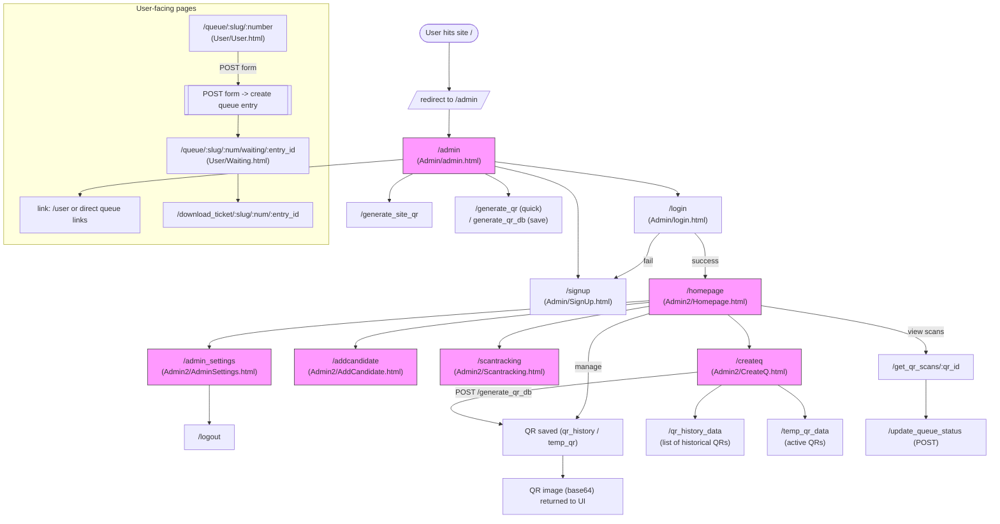

# SmartQ — Site Flowchart

This file contains a Mermaid flowchart that represents the main pages, authentication flow, admin features, and dynamic queue flow for the SmartQ site.

<!-- Render this block with a Mermaid renderer (VS Code extension or mermaid.live) -->


## How to view this diagram

- Option A (quick): Open this file in VS Code and install "Markdown Preview Mermaid Support" or any Mermaid extension, then open Markdown preview (Ctrl+Shift+V).
- Option B (web): Copy the mermaid code block and paste into https://mermaid.live to render and export PNG/SVG.
- Option C (CLI): Install mermaid-cli (npm i -g @mermaid-js/mermaid-cli) and run:

```powershell
mmdc -i docs\flowchart.md -o docs\flowchart.svg
```

(If your `docs\flowchart.md` contains extra markdown, extract only the ```mermaid block for `mmdc`.)

## Notes & next steps

- I included the major routes and where they render templates found in `templates/`.
- Queue numbering for `/queue/:slug/:number` is based on normalized slug matching, so names that only differ by case (like `Test` and `test`) get different queue numbers.
- If you'd like a different layout or a more detailed flow (e.g., database interactions, form fields, or modal flows), tell me which area to expand.
- I can also export an SVG/PNG for you and add it to `docs/flowchart.svg`.
